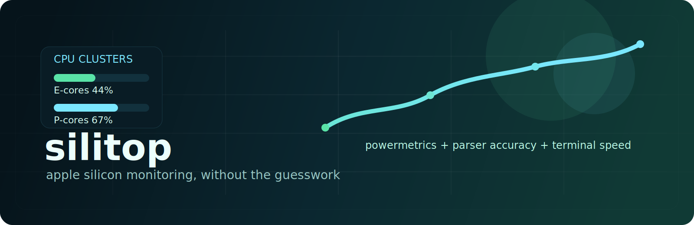

# silitop

<p align="center">
  
</p>

<p align="center">
  <strong>A precise, lightweight Apple Silicon monitor for the terminal.</strong>
</p>

<p align="center">
  <a href="https://github.com/ramixpe/silitop"></a>
  <a href="https://github.com/ramixpe/silitop/blob/main/LICENSE"></a>
  
  
</p>

`silitop` is a serious fork of `asitop` built for a simple reason: Apple Silicon deserves a monitor that is small, fast, and accurate.

This fork starts by fixing one of the most visible trust-breaking issues in the original flow: E-core and P-core utilization that could appear pinned at `100%` even when the machine was not actually saturated. From there, `silitop` becomes the base for a cleaner, more modern Apple Silicon monitoring toolchain.

## Why This Exists

Classic Unix monitoring assumes a flat CPU model.
Apple Silicon is not flat.

A useful monitor for M-series Macs needs to expose the machine the way the machine actually behaves:

- E-cores and P-cores as distinct compute domains
- GPU activity as a first-class signal
- ANE power as a practical AI-era metric
- RAM and swap pressure in the same glance
- Power behavior over time, not just point-in-time load

That is the design center for `silitop`: terminal-native, low overhead, and Apple Silicon-first.

## What Makes `silitop` Better

- Corrects misleading E/P cluster activity reporting by deriving cluster utilization from per-core values and `down_ratio` data
- Keeps startup and runtime lightweight by building on built-in macOS telemetry
- Preserves a compatibility path for existing `asitop` users during migration
- Establishes a cleaner package and repo identity for future iteration under `ramixpe/silitop`
- Adds regression coverage around the parser logic so fixes stay fixed

## Visual Overview

<p align="center">
  
</p>

The current UI stays intentionally lean.
The point is high-signal telemetry at terminal speed, not decorative noise.

## Feature Set

- Live CPU monitoring split into efficiency and performance clusters
- Optional per-core visibility
- GPU frequency and activity
- ANE power visibility
- RAM and swap usage
- CPU and GPU power charts with rolling averages
- Low-overhead terminal rendering
- Apple Silicon-oriented defaults

## Installation

### From GitHub

```bash
python3 -m pip install "git+https://github.com/ramixpe/silitop.git"
```

### Local Development

```bash
python3 -m pip install -e .
```

## Run

Recommended:

```bash
sudo silitop
```

You can also run:

```bash
silitop
```

But `sudo silitop` is the more reliable path because `powermetrics` needs elevated privileges.

## CLI

```bash
silitop [-h] [--interval INTERVAL] [--color COLOR] [--avg AVG] [--show_cores SHOW_CORES] [--max_count MAX_COUNT]
```

Important flags:

- `--interval`: refresh and sample interval in seconds
- `--color`: terminal color index
- `--avg`: rolling average window in seconds
- `--show_cores`: expands to per-core gauges
- `--max_count`: restarts `powermetrics` after a fixed number of updates

Compatibility alias:

```bash
asitop
```

## How It Works

`silitop` stays small by leaning on the telemetry Apple already exposes:

- `powermetrics`: residency, CPU/GPU/ANE energy, thermal pressure
- `psutil`: RAM and swap usage
- `sysctl`: CPU topology and perf-level core counts
- `system_profiler`: GPU core count

This keeps the tool practical for daily use while still exposing the metrics that matter on M-series systems.

## Accuracy

The current fork improves cluster utilization reporting by computing cluster activity from the cores inside the cluster instead of blindly trusting the cluster-level idle field.
That matters because the cluster-level number can be misleading on some Apple Silicon and macOS combinations.

This fork also accounts for `down_ratio`, which improves behavior when parts of a cluster are powered down.

## Positioning

`silitop` is not trying to become a bloated dashboard.
It is trying to become the terminal monitor you trust enough to leave running while you profile compilers, local models, GPU workloads, media pipelines, or long AI sessions on a Mac.

## Roadmap

- Expand tuning for newer M-series generations, especially M3 and M4 variants
- Improve package metadata and release flow for cleaner `pip` distribution
- Add parser fixtures from real-world Apple Silicon traces
- Improve UI polish while keeping the render path lightweight
- Add deeper Apple Silicon-specific telemetry where macOS allows it

## Compatibility

Supported target:

- macOS on Apple Silicon

Not a target:

- Intel Macs
- Linux
- Windows

## Credits

This project starts from the original work in [`tlkh/asitop`](https://github.com/tlkh/asitop).
`silitop` continues from that base with a tighter focus on correctness, maintainability, and Apple Silicon relevance.

## License

MIT. See [LICENSE](LICENSE).
